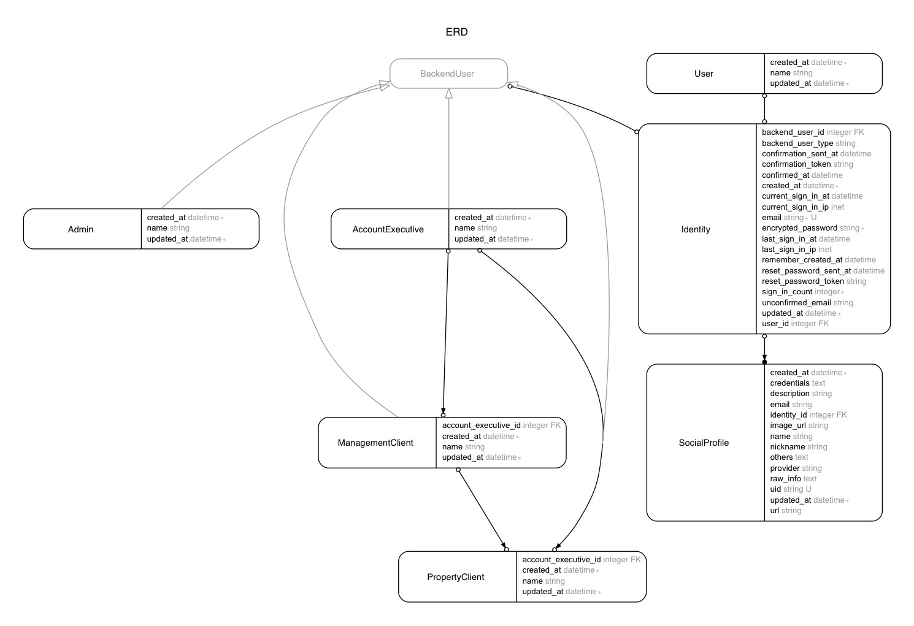

# Polymorphic Devise with JWT

## Environment / gems

- Ruby 2.3.0
- Rails 5.0.0
- Devise + Omniauth
- [Bulma](http://bulma.io/documentation/overview/start/)
- [React on rails](https://github.com/shakacode/react_on_rails)

## Features
- Has a central database table `Identities` for all the registration info.
- Has two groups of users: `Users` and `BackendUsers`.
- BackendUsers can be of any class. (`Admin`, `ManagementClient`, etc)


## Sign up scenarios
- User signs up with email and password.
- User signs up through a social network account.
- SuperUser creates an account manually.


## Log in scenarios
- User logs in with email and password.
- User logs in through a social network account.


## Omniauth (authentication through social network account)
#### non-registered user
- can create a account and log in if he/she has a social account.

#### registered user
- can log in if he/she has a social account.

#### logged-in user
- can connect to/disconnect from his/her social account(s) on the settings page.

#### General
- must go through our email confirmation process unless the Oauth info contains email.


## Models




## Seed example users to database

```bash
bundle exec rake db:seed:users
```

```yml
user:
  email:    "user@example.com"
  password: "password"
admin:
  email:    "admin@example.com"
  password: "password"
```

## Locale
- Most of the Devise-related flash messages are defined in `config/locales/devise.en.yml`
- We can manage text in a single location.

#### How to get a message string

```rb
I18n.t("devise.confirmations.confirmed")
```

With arguments in case that the text expects interpolation.

```rb
I18n.t("devise.omniauth_callbacks.success", kind: "Google")
```

## Checking user-types

```
identity.backend_user?
identity.admin?
identity.account_executive?
identity.management_client?
identity.property_client?
```

## Test

```
bundle exec rake test TEST=test/features && \
bundle exec rake test TEST=test/models/identity_test.rb
```
